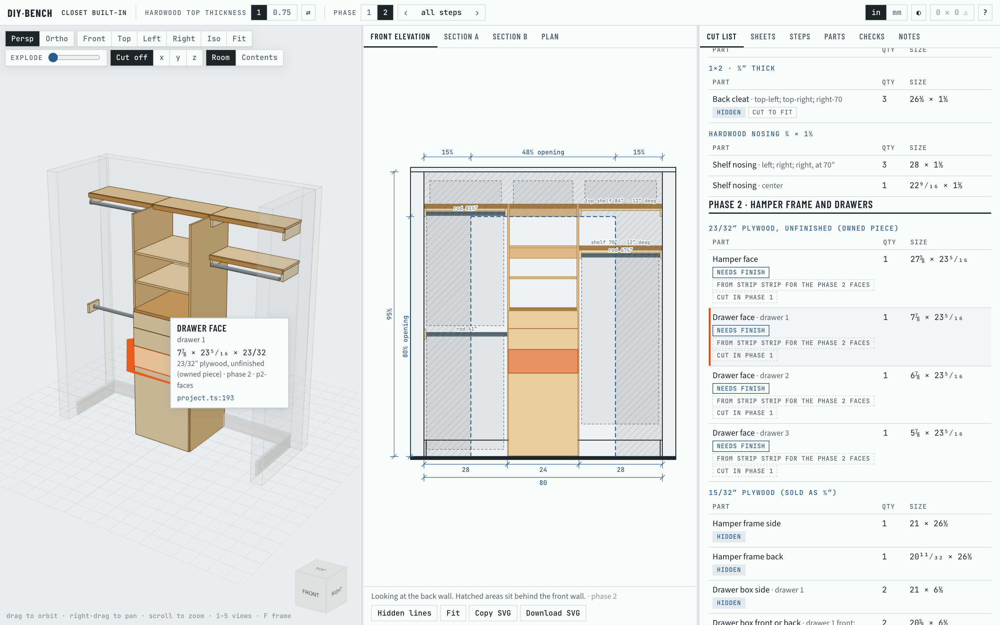
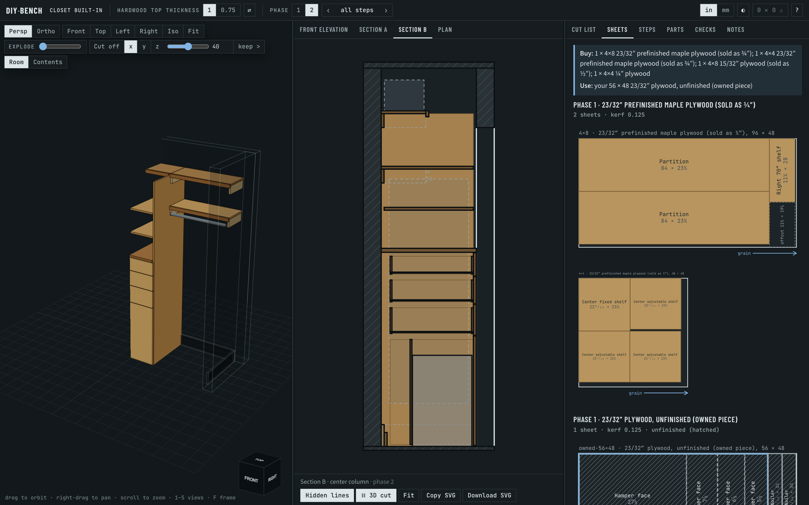
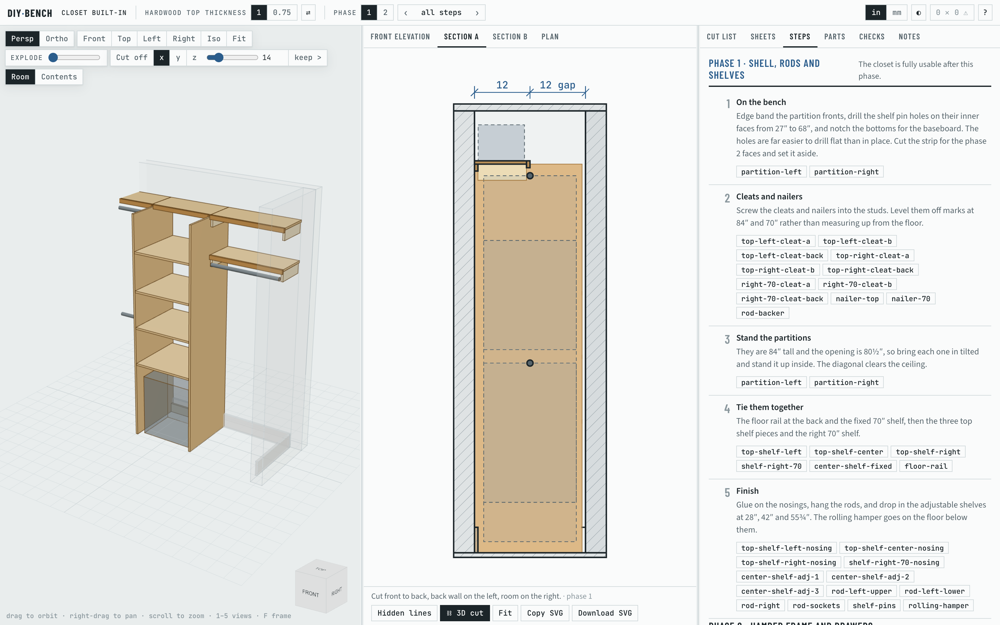

# DIY-bench

A design workbench for woodworking and DIY projects: describe a project to a
coding agent in a terminal and see it change live as a 3D model, drawings, a cut
list, sheet layouts and build steps.

The model, its checks, the cut list, the shopping list and the sheet layouts work from the
command line (milestones M0–M3 of `docs/research/spec.md`), in the browser app (M4–M7), and
with Claude Code in this folder (M8).



| Dark theme: section B cutting the 3D view, and the sheet layouts | Phase 1: section A and the build steps |
|---|---|
|  |  |

## The app

```sh
npm run dev        # http://127.0.0.1:5180 — open it in VS Code's integrated browser or in Chrome
```

Edit `projects/<id>/project.ts` (or ask the agent to) and every view updates in place, keeping
the camera and the selection. A model that throws shows a red bar with the message and the
`project.ts:line`, while the views keep the last good model; a syntax error shows Vite's overlay.
Click a part anywhere (a cut-list row, a sheet placement, a step chip, a row in Parts) to select
it everywhere; shift-click adds or removes. `?` lists the keyboard shortcuts.

The layout has three panes above 1100 px, two below that (3D beside a tabbed pane) and one
tabbed pane below 700 px, so it works in half a VS Code window. Pane sizes and the theme (light,
dark or follow the system) are remembered per browser. The URL holds the project, options,
phase, step and drawing view, so a reload comes back to the same state.

The middle pane draws the project's declared views (elevations, sections, plan) with
dimensions; wheel to zoom, drag to pan, double-click to fit. A section or plan view can cut the
3D view at the same plane. The Steps tab and the `‹ ›` stepper (or `[` `]`) walk the build step
by step in every view, and ⇄ next to an option compares the two choices.

The app writes `.diy-bench/state.json` (what is selected, the phase, the view) for the agent's
hooks; `GET /__wb/health` and `GET /__wb/state` serve the same to the CLI.

## With Claude Code

Run `claude` in this folder (in VS Code: the app in the integrated browser, the terminal on the
right; the task "diy-bench: dev" starts the server). `AGENTS.md` holds the agent's
instructions, and `.claude/settings.json` adds two hooks:

- **Before every prompt** the agent sees what you have selected in the viewer, for example
  `[diy-bench] selected: drawer-face-2 "Drawer face" (drawer 2) · 6⅞ × 23⁵⁄₁₆ × 23/32 ply-raw · … · projects/closet-built-in/project.ts:193`,
  so "make this one 2″ shorter" needs no part name.
- **After every edit to a project** the hook checks every configuration. Errors go back to
  the agent to fix; otherwise it gets a summary of what changed (parts, cut-list rows,
  sheets bought). Edits to the tool itself (`core/`, `app/`, `tools/`, docs) are not checked.

Claude Code reads hooks when a session starts: restart `claude` (or review them under
`/hooks`) after pulling this. Two skills come with it: `new-project` (an interview for
measurements, then `./wb new`) and `review-design`.

```sh
./wb check --all-configs                      # evaluate every project and configuration; report issues
./wb parts --kind panel                       # the parts
./wb part drawer-face-2                       # one part: size, phases, joints, cut-list row, sheet, source line
./wb cutlist --format text|csv|json           # the cut list
./wb shopping                                 # what to buy
./wb sheets [--svg out/]                      # sheet layouts, optionally as SVG
./wb diff --against opt:top=0.75              # what switching an option changes (or --against HEAD~1, last-good)
./wb snapshot [--update]                      # compare or rewrite projects/<id>/expected/
./wb status                                   # is the dev server running; what does the viewer show
./wb state                                    # what is selected, as the agent sees it
./wb show --select partition-left --phase p1  # point the open viewer at something
./wb render --view front --out /tmp/front.png # one panel as a PNG (front, 3d-iso, sheets, cutlist, …)
./wb new hall-closet --template closet        # start a project (blank, shelf, cabinet, closet)
npm run typecheck && npm test                 # types, unit tests and golden files
npm run e2e                                   # browser tests in Chrome (starts the dev server if needed)
```

## What's here

| Path | What it is |
|---|---|
| `docs/research/research.md` | Survey of open-source CAD, 3D, drawing, cut-list and nesting tools |
| `docs/research/decisions.md` | Proposed decisions, with reasons and rejected alternatives |
| `docs/research/spec.md` | Implementation spec and milestones for building the tool |
| `docs/research/spikes/` | Throwaway experiments that settled facts the docs couldn't (see its README) |
| `core/` | The model, evaluation, checks, cut list, shopping list and sheet layouts: pure TypeScript, shared by the CLI and the app |
| `tools/wb.ts` | The `./wb` command-line tool |
| `AGENTS.md`, `.claude/` | Instructions, hooks and skills for Claude Code |
| `projects/closet-built-in/project.ts` | The closet as a model; `notes.md` beside it holds the design reasoning, `expected/` the golden files |
| `projects/closet-built-in/concept-sheet.html` | The closet design as a standalone page: elevation, sections, plan, phases, cut list, sheet layouts. Open it in a browser. |

The research (`research.md`) was written before the repo had a name, so it calls the tool
`workbench`. Read that as DIY-bench. The spec and decisions use DIY-bench.

## Decided since the research

- **Name and home:** `DIY-bench`, private GitHub repo.
- **Selection:** clicking a part in any view to highlight it everywhere is enough.
  Hover is optional, not required.
- **Plywood:** "¾″" sheet goods are 23/32″; "½″" plywood is 15/32″. The drawer boxes and
  hamper frame use ordinary ½″ plywood, not the concept sheet's 12 mm Baltic birch.
- **App shell:** a local Vite web app shown in VS Code's integrated browser, with
  Claude Code in the VS Code terminal on the right. Tauri may wrap it later.
- **UI framework:** React.
- **Outputs:** printed plans (PDF) and a CSV/text cut list. DXF waits until you use a
  CNC or cutting service; GLB, STL and STEP are deferred too.
- **Baseboard:** 5½″ tall, about ¾″ thick.
- **Closet project:** three drawers above a floor-level hamper frame (27″ tall, top
  rail at 24″ to 27″) with a rolling hamper that exits to the left; built in two
  phases. The only design option is the hardwood top thickness, 1″ or ¾″. `spec.md`
  §8 now matches the concept sheet.
- **The owned 48 × 56 sheet:** its grain runs along the 56″ side.

## Verified on

- macOS, Chrome through Playwright (`npm run e2e`): the live loop, selection across views,
  state sync, layouts at 1500, 1000 and 600 px, 3D picking with a section, drawings, steps,
  compare and URL state, `wb show` and `wb render`.
- Claude Code 2.1.289: both hooks run as configured, and `claude -p` names the selected part
  (`RUN_CLAUDE_TESTS=1 npm test -- tests/hooks.test.ts`).
- Not yet verified by hand: VS Code's integrated browser (the M4 manual smoke test: render,
  live edit, and the Parts table's `vscode://file/…` link opening the file at the line).

## Still open

- **Baseboard thickness:** confirm ¾″.
